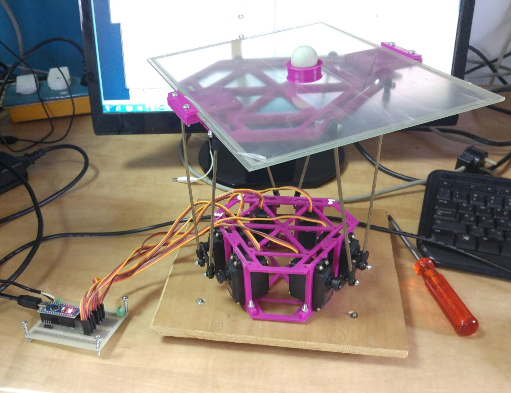
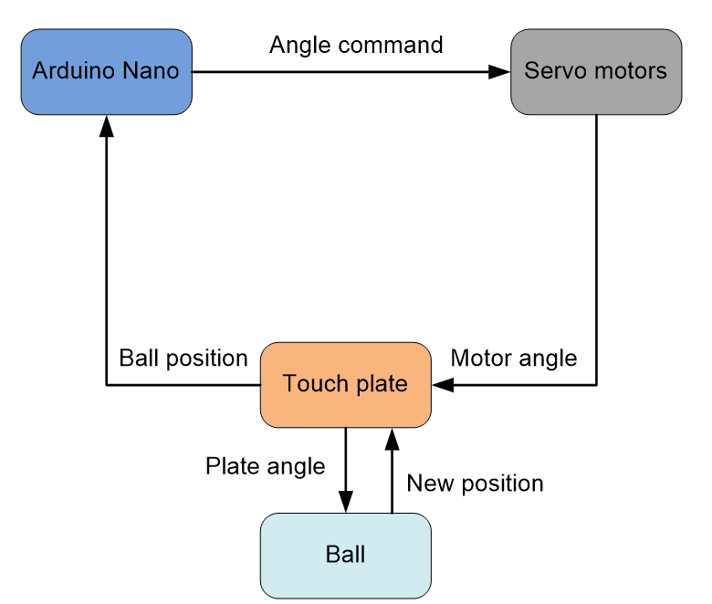

# Ball on Plate Balancing
  

In this project we implement a digital PID controller for ball on plate balancing.  
A link to the project video:  
https://www.facebook.com/kohaik/videos/10212951342449166/?t=0

The system consists of:  
1. Arduino Nano board equipped with ATmega328 microprocessor  
2. Stewart Platform  
3. 6 Servo motors 
4. Touchpad  
5. 5V power supply

# The Control Loop
    
The ball position is measured by the touchpad, and translated to (x,y) coordinates.
Then, the PID controller computes the desired palte angles (roll, pitch) 
that will bring the ball to the origin.
These angles are translated to the desired motors' angles, using the inverse kinematics 
of the stewart platform. 
The Arduino gives the angle commands to the motors, and the ball moves to the next position. 
The process repeats 50 times per second, until the ball arrives at the target. 

# Stewart Platform & Servo Motors Mathematics  
https://web.archive.org/web/20130506134518/http://www.wokinghamu3a.org.uk/Maths%20of%20the%20Stewart%20Platform%20v5.pdf

# Ball on Plate Kinematics  
The ball on plate system can be decomposed into two orthogonal ball on beam systems.  
The kinematic equations as well as the transfer function can be found at  
http://ctms.engin.umich.edu/CTMS/index.php?example=BallBeam&section=SystemModeling  

# Tricks to make things working  
The main difficult in developing "real" systems is that things do not work ideally.   
In our case, the "ball on plate" problem turned out to be "extreme noisy sensors" problem.   
The PID controller by itself is enough robust to balnace the ball, had its input be a clear signal.   
Unfortunately, it is not the case.  

A typical measurment of the touchpad looks like this:

In order to reduce this pysical noise we do the following steps:  
1. Reduce the noise in its pysical source, as much as possible.   
2. Filter the majority of outliers by thresholding.  
3. Smoothen the "almost clean" signal using standard filters (e.g IIR/FIR).    

So we first double the voltage settling time of the touchpad. 
We look at the resulting signal, and see that there is still a considerable mass of outliers. 
The derivative of the position looks like this:  
  
No LPF can deal with such garbage, but a simple thresolding can.  
We compute the distance between consequent samples, and if it is two large we sample again.  
This trick almost eliminated the noise.  
  

The rest of the work can be done by a standard butterworth filter.    
  

Second, 

